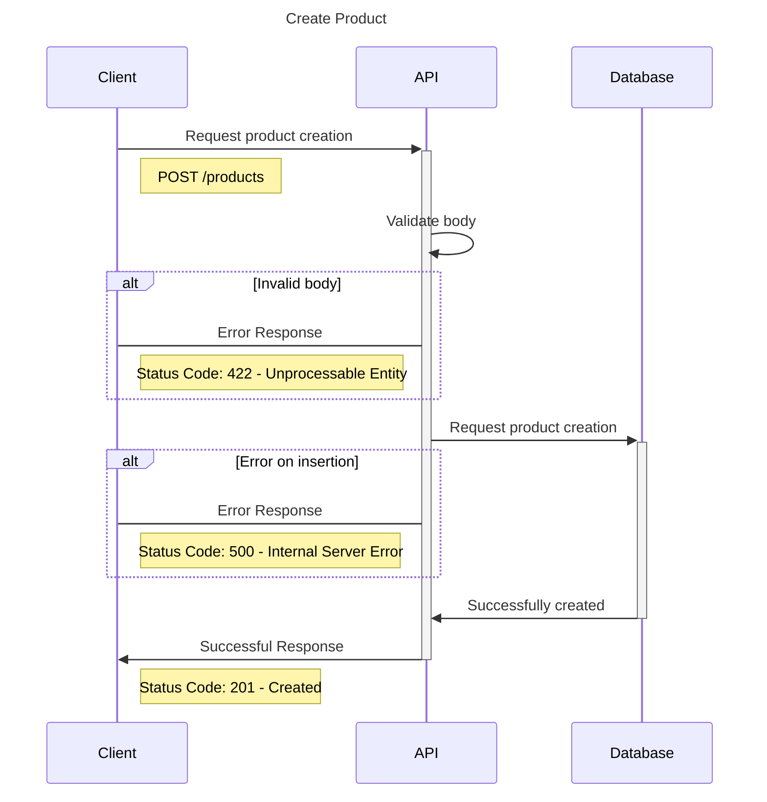
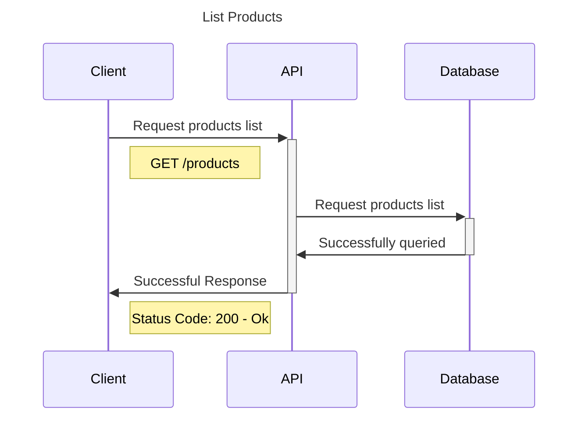
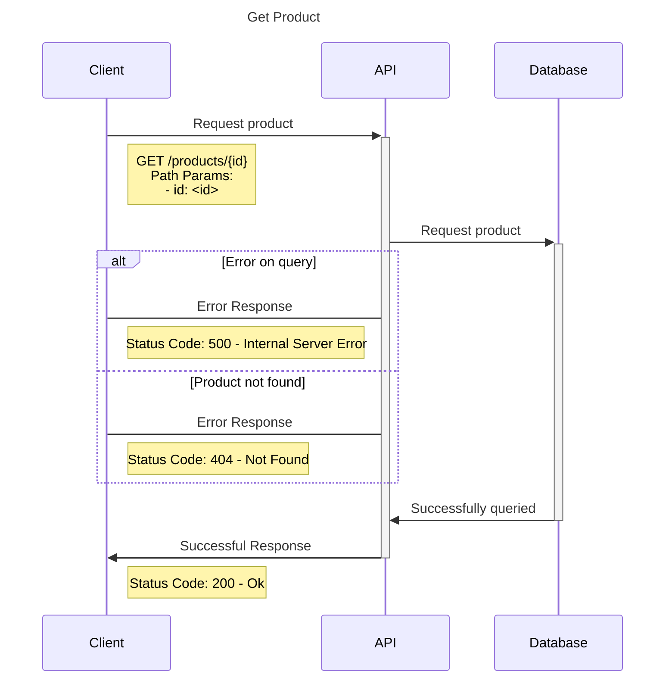
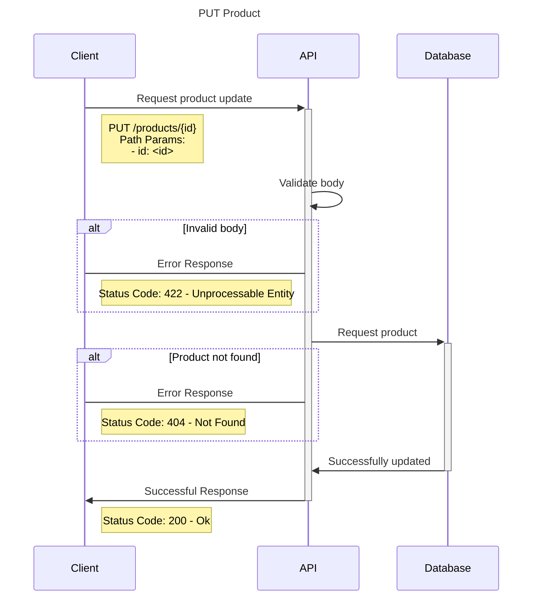
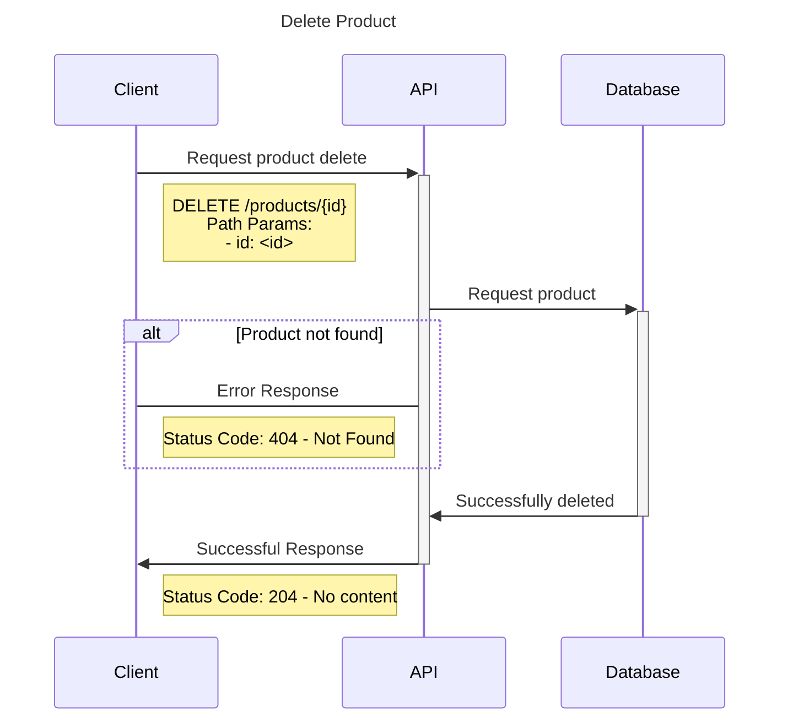

# TDD Project

## What is TDD?
TDD stands for Test Driven Development. The idea of TDD is that you work in cycles.

### TDD Cycle

### Advantages of TDD
- Deliver high-quality software;
- Test to find potential failures;
- Create integration tests and unit tests;
- Avoid writing complex or unnecessary code;

The purpose of TDD is to write tests before the actual code, ensuring higher quality in the project. Additionally, if you leave testing until the end, you might end up not doing it at all. This results in an application that is more prone to errors and of lower quality.

# Store API
## Project Summary
This document provides information on the development of an API using FastAPI and TDD.

## Objetive
The main goal of this application is to provide practical knowledge of TDD by developing an API with the Python framework FastAPI. It uses MongoDB as the database, Pydantic for validations, Pytest for testing, among other libraries.

## What is it?
An application that:
- Is for educational purposes;
- Allows practical learning about TDD with FastAPI and Pytest;

## What is it not?
An application that:
- Communicates with external apps;

## Proposed Solution
Development of a simple application using TDD to understand how to create tests with pytest. This includes building tests for Schemas, Usecases, and Controllers (integration tests).

### Architecture
||
|:--:|
| C4 Diagram of the Store API | Diagrama de C4 da Store API |

### Database - MongoDB
||
|:--:|
| Database - Store API |

## StoreAPI
### Sequence Diagrams for the Product Module
#### Product Creation Diagram

#### Product Listing Diagram

#### Product Detail Diagram

#### Product Update Diagram

#### Product Deletion Diagram

## Final Challenge
- Create
    - Map an exception in case of an insertion error and capture it in the controller.
- Update
    - Modify the patch method to return a Not Found exception when the data is not found.
    - Handle the exception in the controller to return a user-friendly message.
    - When updating data, the updated_at field should correspond to the current time, and allow modification of updated_at.
- Filters:
    - Register products with different prices.
    - Apply a price filter like this: (price > 5000 and price < 8000).

## Prepare Environment

We will use Pyenv + Poetry, follow the link below for setting up the environment:

[poetry-documentation](https://github.com/nayannanara/poetry-documentation/blob/master/poetry-documentation.md)

## Useful Documentation Links
[mermaid](https://mermaid.js.org/)

[pydantic](https://docs.pydantic.dev/dev/)

[validatores-pydantic](https://docs.pydantic.dev/latest/concepts/validators/)

[model-serializer](https://docs.pydantic.dev/dev/api/functional_serializers/#pydantic.functional_serializers.model_serializer)

[mongo-motor](https://motor.readthedocs.io/en/stable/)

[pytest](https://docs.pytest.org/en/7.4.x/)

## Note
This is a fork from the [original DIO store_api project](https://github.com/digitalinnovationone/store_api). The project is from the Python AI Backend Developer Bootcamp [(DIO)](https://www.dio.me/).  
The API was coded throughout the course and I only made the modifications needed for the challenge. 
